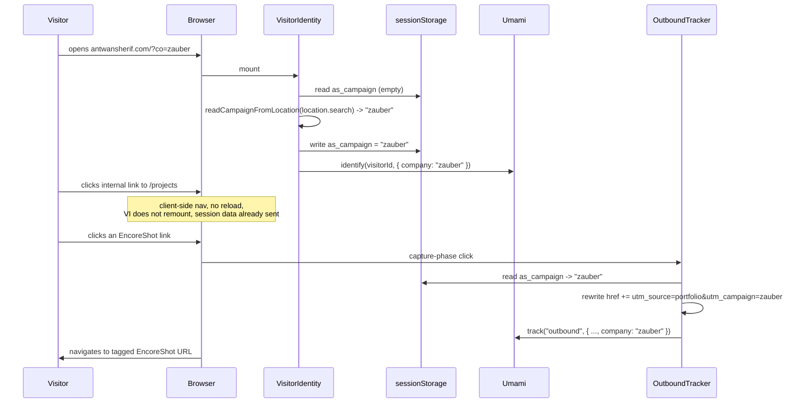

# Site-wide company attribution (`?co=`)

## Problem

`/cv?co=<company>` already tags a CV visit with `utm_campaign=<slug>` on own-property
links (portfolio + EncoreShot), server-rendered per request. Nothing else on the site
does this:

- No other route reads a company param.
- Umami's UTM columns are pageview-scoped, not session-scoped (verified against Umami
  source: `docs/research/umami-utm-session-attribution.md`). A `?co=` landing hit does
  not carry forward to later pageviews in the same visit via UTM alone.
- Own-property links (EncoreShot mentions, self-links) outside `/cv` are never
  campaign-tagged, so a company clicking around loses attribution on the first click
  off the landing page.

Goal: one link, e.g. `antwansherif.com/?co=zauber`, works from any entry page, tags the
whole Umami session (not just the landing pageview), and keeps own-property links
tagged as the visitor navigates the rest of the site. `/cv?co=` keeps working exactly
as it does today — this is additive, not a replacement.

## Non-goals

- Rewriting `/cv`'s server-rendered campaign resolution. Its route, page, document,
  and download button stay untouched; the PDF route (`/api/cv-pdf`) has no client to
  read `sessionStorage` from, so it must keep reading `?co=` directly. `cv-campaign.ts`
  is shared infrastructure (`slugifyCompany`, `withCampaign`, `isOwnPropertyUrl`), not
  the `/cv` route itself, so it's in scope for the small generalization below without
  that counting as touching `/cv`.
- Cross-day or cross-tab persistence. A campaign tag describes one visit, not a
  returning identity — that's what the visitor UUID (`analytics-identity.ts`) already
  covers, orthogonally.
- Retrofitting `docs/analytics-utm-conventions.md`'s Segment examples to be
  session-aware via UTM columns — that's structurally impossible per the research
  doc. This spec's `identify()`-based mechanism is the fix; a follow-up doc pass to
  correct that convention doc is worth doing but is out of scope here.

## Architecture

Three pieces, each extending an existing mechanism rather than adding a new one.

### 1. Capture `?co=` on any page, persist for the visit

New pure helper, `src/lib/site-campaign.ts`:

```ts
export function readCampaignFromLocation(search: string): string | null
```

Parses `co` from a query string, runs it through the existing `slugifyCompany`
(`cv-campaign.ts`), returns `null` for missing/empty/all-punctuation input. Pure,
matches the existing `slugifyCompany`/`isOwnPropertyUrl` test style.

`VisitorIdentity` (`src/components/analytics/visitor-identity.tsx`, already mounted
globally in `layout.tsx`) gains a mount-time read:

- If `sessionStorage['as_campaign']` is already set, use it.
- Else, call `readCampaignFromLocation(window.location.search)`. If it returns a
  slug, write it to `sessionStorage['as_campaign']`.
- Feed the resolved slug into the existing `sessionCompany` sticky variable and
  `identify()` call — same code path the story-page `company` prop already uses, so
  a story unlock's `company` and a `?co=` landing's `company` compose the same way
  they do today (last write wins, per the existing comment on `sessionCompany`).

`sessionStorage` (not `localStorage`): the tag describes this visit, dies with the
tab. A full reload without `?co=` still resolves the campaign, since it re-reads
`sessionStorage` before falling back to the URL.

**First-touch wins within a tab.** Once `as_campaign` is set, a later `?co=` on a
different URL in the same tab session is ignored (the "already set" branch above
short-circuits before re-parsing the URL). Matches how the CV's own campaign
resolution already behaves per-request rather than merging, and avoids a visitor with
two links open in the same tab flapping between companies mid-session.

### 2. Whole-session attribution in Umami

No new mechanism — this is (1) landing in `identify()`, which already writes to
Umami's `Session` row via `SESSION_COLUMNS` (confirmed in the research doc), genuinely
session-scoped and segmentable, unlike `utm_campaign`. Once (1) is wired, this piece
is done.

### 3. Own-property outbound links stay tagged site-wide

`OutboundTracker` (`src/components/analytics/outbound-tracker.tsx`) is a single
delegated, capture-phase `click` listener already firing on every anchor click across
the site. Extend its handler:

```
on click:
  anchor = closest a[href]
  if own-property host (antwansherif.com | encoreshot.com) AND campaign known:
    anchor.href = withCampaign(anchor.href-resolved-with-utm_source=cv-equivalent, campaign)
  existing buildOutboundEvent / track(...) call, now also passing `company` prop
```

`OWN_HOSTS` moves from `cv-campaign.ts` into a shared location (or stays exported from
there — see Components below) so both the CV path and `OutboundTracker` use the same
set. Mutating `anchor.href` synchronously inside a capture-phase listener, before the
event's default action runs, is sufficient to change where a standard link click
navigates — no `preventDefault`/re-navigate dance needed.

One wrinkle: `buildOutboundEvent` currently treats same-host (`antwansherif.com`)
links as *not outbound at all* (`if (url.host === currentHost) return null`) — by
design, per the hygiene rule against tagging internal navigation. That's still
correct for the *event* (an internal nav click isn't an "outbound" event). But
`OutboundTracker`'s href-rewrite step runs before that same-host check filters the
event, so it can still rewrite same-host self-links that carry `utm_source=cv`
already (e.g. any literal `antwansherif.com/...` URL embedded in content) without
also firing a spurious `outbound` event for them. In practice, self-links matching
that shape are rare outside the CV; the CV's own campaign resolution already handles
them there.

`withCampaign` currently requires `utm_source=cv` already present in the URL
(`cv-campaign.ts` line 35) before it will append `utm_campaign`. Site-wide
own-property links (e.g. an EncoreShot mention in a story or resume entry) don't
carry `utm_source` at all today. `withCampaign` needs a small generalization: accept
the case where `utm_source` is absent by stamping `utm_source=portfolio` (a new,
site-wide analog of the CV's `utm_source=cv`) at the same time as `utm_campaign`,
rather than requiring the caller to have pre-stamped `utm_source=cv`. This keeps the
CV's own call sites (which do pre-stamp `utm_source=cv`) working unchanged, since
`utm_source` is already present there and won't be overwritten.

## Components touched

| File | Change |
|---|---|
| `src/lib/site-campaign.ts` | **New.** `readCampaignFromLocation`, pure. |
| `src/lib/cv-campaign.ts` | Export `OWN_HOSTS` (or an `isOwnPropertyUrl`-adjacent helper reusable outside the CV surface). Generalize `withCampaign` to stamp `utm_source=portfolio` when no `utm_source` is present, instead of requiring `utm_source=cv` pre-stamped. |
| `src/components/analytics/visitor-identity.tsx` | Read `?co=` / `sessionStorage` on mount when no explicit `company` prop is passed; write resolved slug to `sessionStorage`. |
| `src/components/analytics/outbound-tracker.tsx` | Rewrite own-property anchor `href` with the persisted campaign before navigation; pass `company` into the `outbound` event props. |
| `src/lib/analytics.ts` | Add `company?: string` to `OutboundProps`. |

No changes to `/cv`'s route, `cv-document.tsx`, `cv-download.tsx`, or
`/api/cv-pdf` — that path is untouched, per Non-goals.

**Fan-out note.** Five files touched, each a single-responsibility edit to an
existing component rather than the same logic duplicated across them: one new pure
parser, one generalized existing helper, one mount-time read added to an existing
hook, one rewrite step added to an existing click delegate, one type union entry.
Consolidating further would mean merging `VisitorIdentity` and `OutboundTracker` (two
components with distinct triggers, mount vs. click) or moving campaign logic out of
`cv-campaign.ts`, both of which would break existing boundaries for no gain. The
fan-out is inherent to reusing three already-separate systems rather than building a
new one.

## Data flow



## Error handling

Same discipline as the rest of the analytics layer: every new code path is wrapped to
never throw into a render, and no-ops outside production/SSR, matching `track()` and
`identifyVisitor()`'s existing guards. `sessionStorage` access is wrapped in
try/catch (private browsing / storage-disabled contexts throw on write) with silent
fallback to "no campaign known" — never blocks navigation or breaks a click.

## Testing

Pure helpers get unit tests, same style as `cv-campaign.test.ts` /
`encoreshot.test.ts`:

- `readCampaignFromLocation`: missing param, empty value, punctuation-only value,
  valid value, value alongside other query params.
- Generalized `withCampaign`: no `utm_source` present (new case, stamps both source
  and campaign), `utm_source=cv` already present (existing CV behavior, unchanged),
  `utm_campaign` already present (no-op, existing behavior).

`OutboundTracker`'s href-rewrite is DOM-dependent glue (per the analytics AGENTS.md
convention, glue stays untested-thin, the logic it calls is what's tested). A
lightweight DOM test (jsdom, simulate a click on an anchor, assert rewritten `href`
and the `company` prop on the tracked event) is worth adding given this is new
behavior, not just a wiring change — mirrors the bar the AGENTS.md sets for "new
measurable user interaction."
