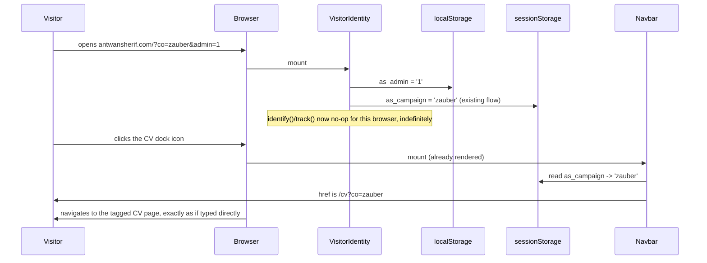

# Self-visit exclusion & CV link carry-forward

## Problem

Two gaps found in the [2026-09-05 analytics audit](../../superpowers/plans):

1. **Every visit counts, including the site owner's own.** There's no way to browse the
   portfolio without polluting the same visitor pool that every report, funnel, and goal
   in Umami sits on top of.
2. **The homepage's CV link doesn't carry a known campaign.** `/cv?co=<company>` already
   tags a CV visit; landing on `antwansherif.com/?co=<company>` tags the whole session
   (shipped 2026-09-04/05), but the navbar's CV link still points at a bare `/cv` — a
   visitor who lands on the homepage and clicks through loses the company tag their own
   visit already carried.

This spec covers both. It does not cover the audit's other findings — those are pure
Umami-dashboard configuration (a Cohort, a funnel fix, a Segment, a doc edit) or an
investigation (bot/referrer-spam traffic), not code. Tracked as a checklist in the
Appendix so they aren't lost, not as implementation tasks here.

## Non-goals

- No change to `/cv`'s own `?co=` resolution, `cv-campaign.ts`, or `/api/cv-pdf` — all
  stay exactly as they are, per the standing constraint from the site-wide attribution
  spec.
- No change to the story-unlock **server** channel (`story_unlock`/`story_view`,
  `src/app/(site)/(stories)/stories/unlock/actions.ts`). It's a plain form action with
  no client-side wrapper today, and it has produced zero events in three months of real
  traffic — adding a client-side admin-flag relay there is real complexity for a channel
  with no current volume. Revisit if that changes.
- Bot/referrer-spam filtering is out of scope here — it needs confirmation (are
  `mundusearch.com` / `anyiyun.net` / `picfindr.com` actually bots?) before any filter
  decision, and any fix is Umami-side, not code.
- **Not a security boundary.** `?admin=1` is a plain, guessable value, not a secret. The
  only thing it does is stop *your own* analytics from sending. Worst case if someone
  else finds it: they turn off tracking for themselves. Nothing sensitive is gated by it.

## Architecture

### 1. Self-visit exclusion

New file, `src/lib/analytics-admin.ts`, two pure functions matching the existing
`site-campaign.ts` / `analytics-identity.ts` style:

```ts
export const ADMIN_STORAGE_KEY = 'as_admin'

/** Parse `?admin=` from a query string. '1' to set, '0' to clear, anything else
 *  (including absent) is "no instruction" — null. Pure. */
export function resolveAdminParam(search: string): '1' | '0' | null {
  const raw = new URLSearchParams(search).get('admin')
  return raw === '1' || raw === '0' ? raw : null
}

/** Whether this browser is currently flagged as the site owner's own admin visit. Pure
 *  (storage injected), matches getOrCreateVisitorId's style. */
export function isAdminVisit(storage: Pick<Storage, 'getItem'>): boolean {
  return storage.getItem(ADMIN_STORAGE_KEY) === '1'
}
```

`VisitorIdentity` (`src/components/analytics/visitor-identity.tsx`, already the single
global, mount-time "figure out what this visit means" component via `layout.tsx`) gains
one more read alongside its existing campaign resolution:

- `resolveAdminParam(window.location.search)` — `'1'` writes
  `localStorage[ADMIN_STORAGE_KEY] = '1'`; `'0'` removes the key; `null` leaves whatever
  was already stored untouched. Wrapped in the same try/catch discipline already used
  for `sessionStorage` access in this file.
- This uses `localStorage`, not `sessionStorage` — the point is that it survives across
  tabs and days once set, unlike the campaign slug which is deliberately per-tab.

**Not the same thing as the existing `is_admin` session prop.** `VisitorIdentity`
already accepts an `isAdmin` prop, set only on gated story pages
(`src/app/(site)/(stories)/stories/[slug]/page.tsx`) when the unlocking company is on an
`adminCompanies` allowlist — that's a content-access concept (a real testing
password), unrelated to this one. This spec's `as_admin` is a separate,
site-wide, opt-in "don't send my own analytics at all" switch. Same English word,
different mechanism — worth a comment at both definitions so a future reader doesn't
conflate them.

`track()` (`src/lib/analytics.ts`) and `identifyVisitor()`
(`src/lib/analytics-identity.ts`) each gain one early return, before touching
`window.umami`:

```ts
if (isAdminVisit(window.localStorage)) return
```

placed after the existing `NODE_ENV`/`window` guards, so the ordering of no-op checks
stays consistent (env → SSR → admin → the actual call).

### 2. CV link carry-forward

`src/components/navbar.tsx` (already `'use client'`) reads the same site-wide campaign
slug the rest of the mechanism already writes — `CAMPAIGN_STORAGE_KEY` from
`src/lib/site-campaign.ts`, exported today, no new constant needed:

```ts
const [campaign, setCampaign] = useState<string | null>(null)
useEffect(() => {
  try {
    setCampaign(window.sessionStorage.getItem(CAMPAIGN_STORAGE_KEY))
  } catch {
    /* private browsing — falls back to the untagged link */
  }
}, [])
```

and the existing static `href="/cv"` (line 108) becomes:

```tsx
href={campaign ? `/cv?co=${campaign}` : '/cv'}
```

`/cv`'s own page (`src/app/cv/page.tsx`) is untouched — it still just reads `?co=` from
whatever URL it's handed, exactly as today. This link is the only thing that changes;
everything downstream of a click behaves exactly like a visitor who typed
`/cv?co=<company>` directly, because that's exactly the URL they're now handed.

## Components touched

| File | Change |
|---|---|
| `src/lib/analytics-admin.ts` | **New.** `ADMIN_STORAGE_KEY`, `resolveAdminParam`, `isAdminVisit`, all pure. |
| `src/components/analytics/visitor-identity.tsx` | Read `?admin=` on mount, write/clear `localStorage`. |
| `src/lib/analytics.ts` | `track()` gains one early-return guard. |
| `src/lib/analytics-identity.ts` | `identifyVisitor()` gains the same guard. |
| `src/components/navbar.tsx` | CV link's `href` becomes campaign-aware. |

**Fan-out note.** Five files, each a one- or two-line addition to an existing function or
component — a new pure-logic module plus its natural call sites (the two send paths that
need the guard, the one mount point that resolves it, the one link that consumes the
campaign). Every other file path in this spec (`cv-campaign.ts`, `/cv/page.tsx`,
`/api/cv-pdf`, the story-unlock action, `docs/analytics-utm-conventions.md`) is named
under Non-goals or the Appendix — referenced for context, not touched. No shared logic
is duplicated across the five; consolidating further would mean merging `track()` and
`identifyVisitor()` (two functions with distinct signatures and callers today), which
would cost more than the two-line guard it'd save.

## Data flow



## Error handling

Same discipline as the rest of the analytics layer: every new read is wrapped in
try/catch with silent fallback (no campaign / not admin), never throws into a render,
no-ops outside production (`track`/`identifyVisitor`'s existing guard covers the new
early return automatically, since it sits inside the same function).

## Testing

Pure helpers get unit tests, same style as `site-campaign.test.ts`:

- `resolveAdminParam`: `'1'` → `'1'`, `'0'` → `'0'`, missing → `null`, any other value
  (e.g. `'true'`, `'yes'`) → `null`.
- `isAdminVisit`: `'1'` in storage → `true`; absent, or any other value → `false`; no
  throw when storage access itself throws (private browsing) — mirrors
  `resolveSiteCampaign`'s existing try/catch test coverage.
- `track()` / `identifyVisitor()`: one new case each — "no-ops when `as_admin` is set,"
  alongside the existing "no-ops outside production" / "no-ops when `window` is
  undefined" cases already in `analytics.test.ts` / `analytics-identity.test.ts`.

**Thin glue, manually verified** (per the analytics `AGENTS.md` convention — DOM glue
stays untested-thin, the logic it calls is what's tested):

- `VisitorIdentity`'s new `?admin=` read: visit `/?admin=1`, confirm
  `localStorage.as_admin === '1'`; visit `/?admin=0`, confirm the key is gone.
- Navbar CV link: visit `/?co=acme`, confirm the CV dock icon's resolved `href` is
  `/cv?co=acme`; visit with no `?co=`, confirm it's still plain `/cv`.

No integration test needed — both surfaces are pure reads over already-tested storage
helpers, and the manual checks above are the same shape as the site-wide attribution
spec's own manual verification step.

## Appendix — config-only items (not implemented here)

From the same audit, tracked here so they aren't lost, no code required:

- [ ] Build a per-company **Cohort** in Umami (`Cohorts` tab, currently empty) keyed on
  the `company` session prop.
- [ ] Fix the **Homepage Churn** funnel — every step currently filters on bare
  `section_view` with no `content_id`, so all five steps show identical numbers. Add a
  `content_id` filter per step.
- [ ] Add `linktree` to the controlled `utm_source` vocabulary in
  `docs/analytics-utm-conventions.md` — it's already live in real traffic, undocumented.
- [ ] Wire a `company`-scoped **Segment** (same recipe as `Engineer-leaning` /
  `Recruiter-leaning`) and apply it to the existing Goals/Funnels.
- [ ] Investigate the China-heavy / spam-shaped referrer traffic (`mundusearch.com`,
  `anyiyun.net`, `picfindr.com`) before deciding on any exclusion.
</content>
